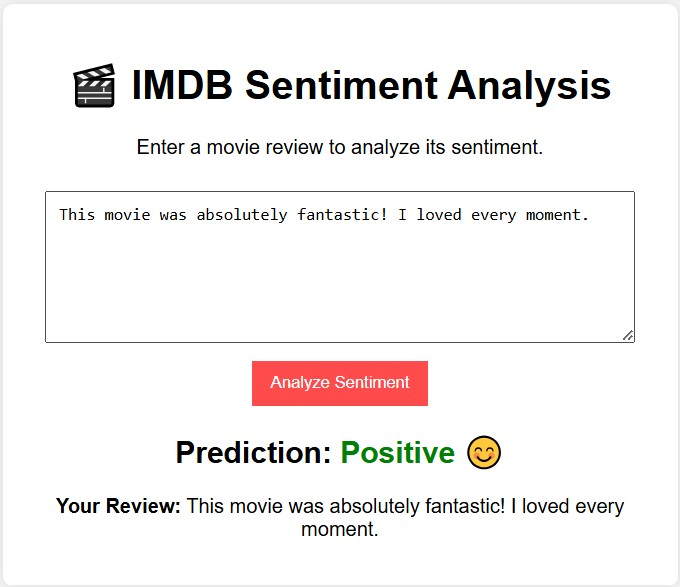

# Intelligent Sentiment Analyzer Application


## 📌 Project Overview
This project aims to perform sentiment analysis on IMDB movie reviews using machine learning algorithms. The dataset consists of labeled reviews categorized as positive or negative. The goal is to build an end-to-end sentiment analysis pipeline, incorporating data preprocessing, model training, evaluation, and deployment.

## 🎯 Features
- Data collection and extraction from a MySQL relational database
- Text preprocessing (tokenization, stopword removal, stemming, etc.)
- Feature extraction using TF-IDF etc.
- Model training with various ML algorithms (Logistic Regression, Naive Bayes, etc.)
- Evaluation metrics including accuracy, precision, recall, F1-score, and ROC-AUC
- Flask API for real-time sentiment predictions using user inputs.
- Future enhancements with deep learning models and cloud deployment


## 📂 Dataset

- **Dataset Name**: IMDB Movie Reviews
- **Source**: Kaggle
- **Size**: 50,000 labeled reviews (25k train, 25k test)
- **Labels**: `positive`, `negative`

## 🔧 Tech Stack

- **Programming Language**: Python
- **Libraries**: `scikit-learn`, `pandas`, `numpy`, `matplotlib`, `seaborn`, `pymysql`, `Flask`
- **Vectorization**: TF-IDF
- **Models**: Logistic Regression, Naive Bayes etc.
- **Deployment**: Flask

## 📌 Project Workflow
1. **Data Collection** - Load and preprocess IMDB dataset.
2. **Data Cleaning** - Remove noise (HTML tags, punctuation, stopwords, etc.).
3. **Exploratory Data Analysis (EDA)** - Visualize review distributions, word counts, and sentiment trends.
4. **Feature Engineering** - Convert text into numerical features using TF-IDF.
5. **Model Training & Evaluation** - Train ML models and optimize using hyperparameter tuning.
6. **Model Deployment** - Serve predictions via a Flask API.
7. **Pipeline automation** - Automating all the steps.
8. **User Interface** - Create a simple UI for user interacting.


## 🚀 How to Run this Project

### 1. Clone the Repository

```bash
$ git clone https://github.com/gaurav0199/Intelligent-Sentiment-Analyzer-Application.git
$ cd Intelligent-Sentiment-Analyzer-Application
```

### 2. Install Dependencies

```bash
$ pip install -r requirements.txt
```

### 3. Run the Application

```bash
$ python app.py
```

## 🚀 For Demo App
#### Run Notebook
```bash
$  demo_app.ipynb
```
## Test Result


## 📊 Model Performance

Achieved **89% accuracy** using **Logistic Regression** with **TF-IDF vectorization**. Evaluation metrics:

- **Precision**: 88%
- **Recall**: 89%
- **F1-Score**: 88%
- **ROC-AUC**: 91%


## 📬 Connect with Me


🐙 [GitHub](https://github.com/gaurav0199/)\
📧E-mail: [gauravkrsingh70@gmail.com](gauravkrsingh70@gmail.com)


*Happy Learning! 🚀 Stay Connected!*


